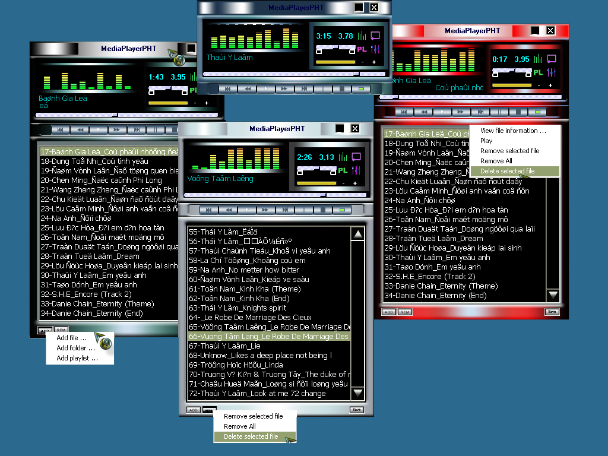



## MediaPlayerPHT

### Description

Play mp3,wma,wav or midi files.Save playlist format m3u and load PLS,M3U playlist.Change skin and opacity.It's also tag ID3v1 editor.
 
### More Info
 

             |
---                |---
**Submitted On**   |2005-06-24 19:30:46
**By**             |[Hanachacha](https://github.com/Planet-Source-Code/PSCIndex/blob/master/ByAuthor/hanachacha.md)
**Level**          |Beginner
**User Rating**    |5.0 (10 globes from 2 users)
**Compatibility**  |VB 6\.0
**Category**       |[Sound/MP3](https://github.com/Planet-Source-Code/PSCIndex/blob/master/ByCategory/sound-mp3__1-45.md)
**World**          |[Visual Basic](https://github.com/Planet-Source-Code/PSCIndex/blob/master/ByWorld/visual-basic.md)
**Archive File**   |[MediaPlaye1905456242005\.zip](https://github.com/Planet-Source-Code/hanachacha-mediaplayerpht__1-61328/archive/master.zip)

